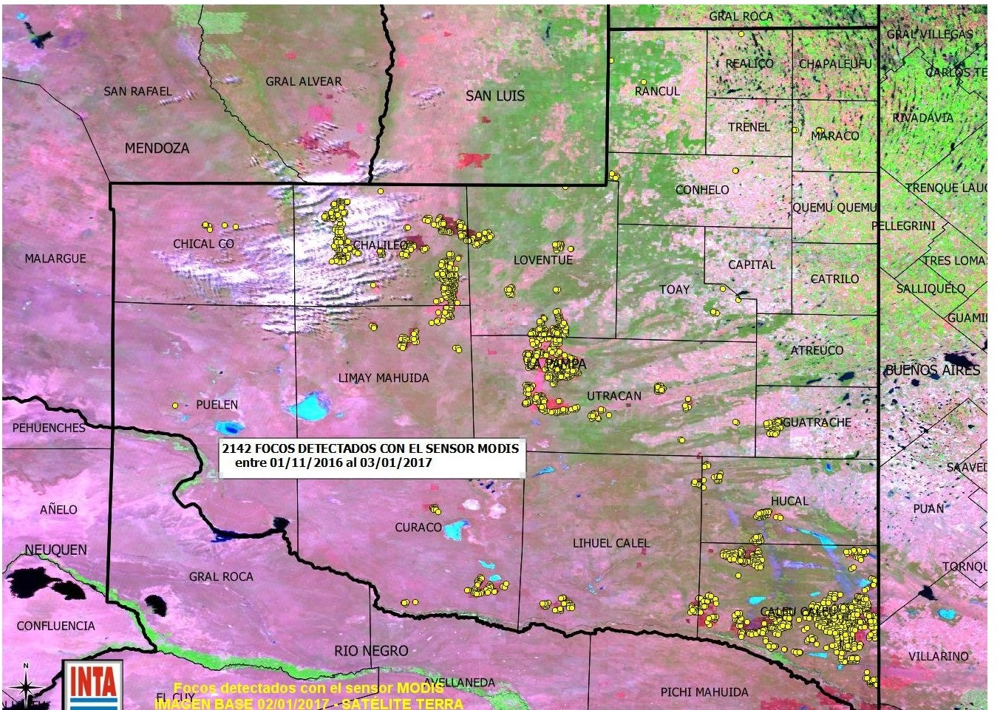
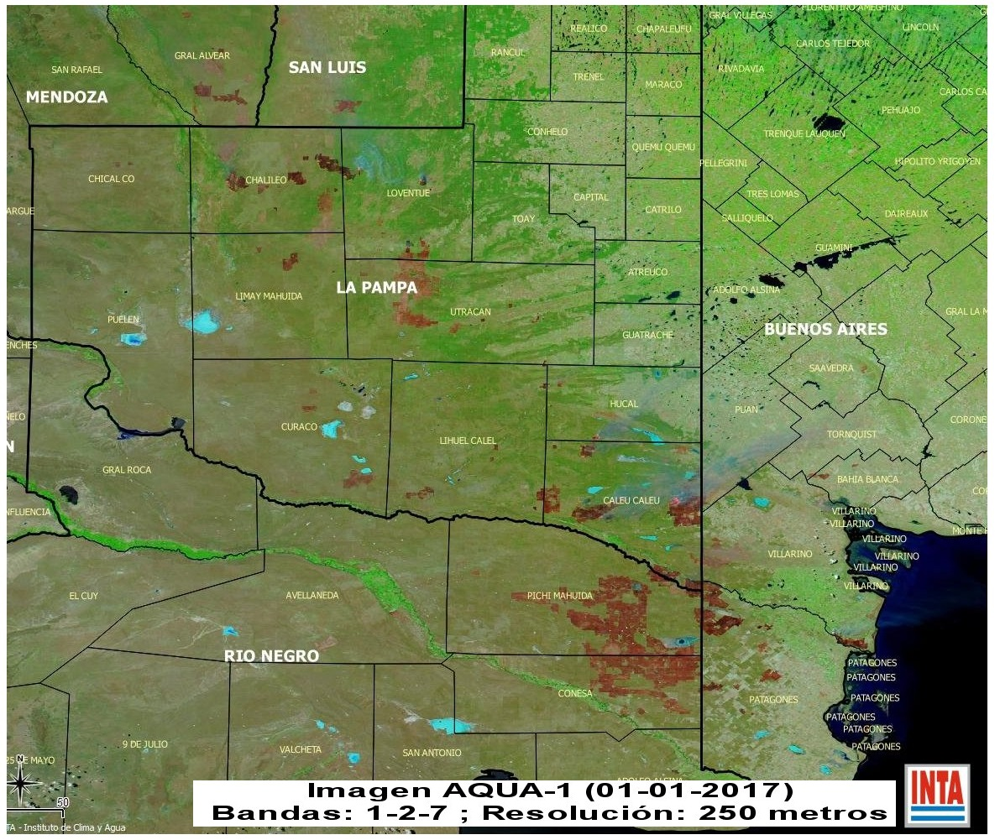
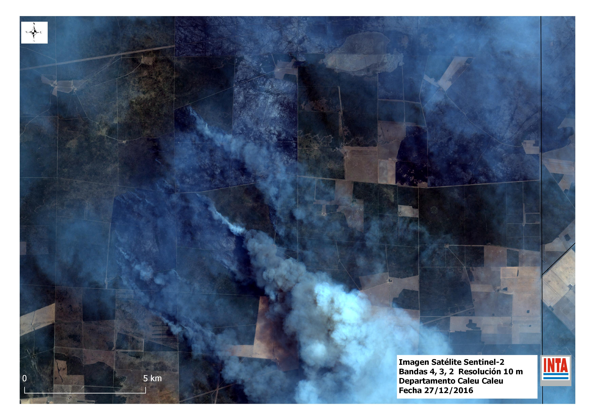
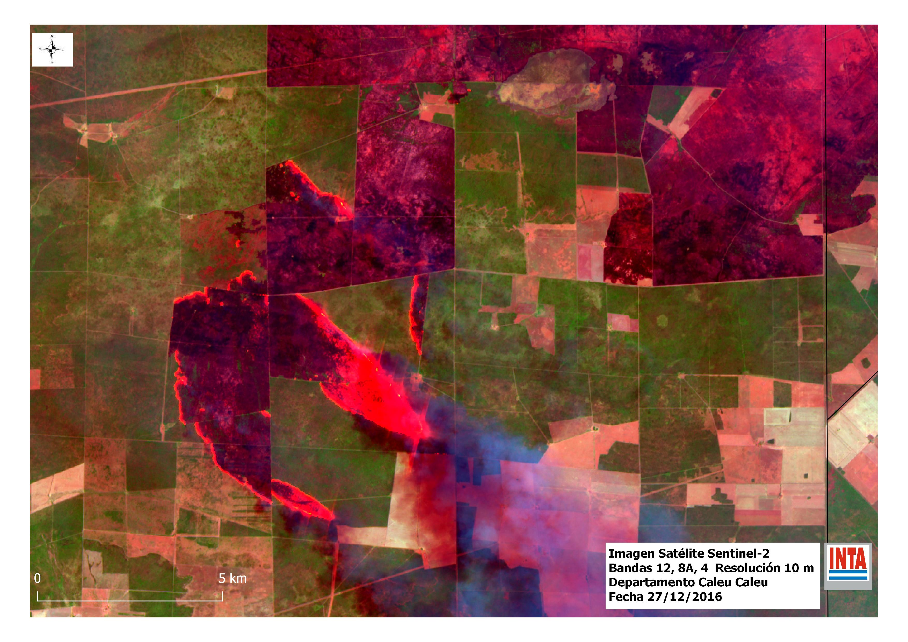

En diferentes medios de comunicación han circulado imágenes de la NASA sobre los incendios que están ocurriendo en nuestra provincia. Este informe pretende aportar más sobre la forma que se generan esas imágenes y que utilidad presentan para el monitoreo y análisis de fenómenos extremos como los incendios.

**Teledetección, sensores remotos e imágenes satelitales**

La adquisición de información a pequeña o gran escala de un objeto o fenómeno, utilizando dispositivos e instrumentos llamados sensores y que no están en contacto directo con el objeto se denomina teledetección. Una de sus ventajas principales radica en el hecho que no es necesario estar en contacto con el objeto de estudio y por lo tanto hace posible recoger información de áreas peligrosas o inaccesibles.

En general, estos sensores están presentes en satélites, aviones y plataformas a nivel de campo y registran diferente tipo de información, de acuerdo a la porción del espectro electromagnético que pueden registrar. Los sensores activos son responsables de enviar una señal y registrar la señal reflejada, evaluando la diferencia entre ellos, como por ejemplo el RADAR Meteorológico que tenemos en INTA Anguil. Por otro lado, los sensores pasivos operan mediante el registro de la radiación electromagnética reflejada por el sol, como por ejemplo el satélite LANDSAT, uno de los utilizados por la NASA.

Una de las formas más conocidas de mostrar la información generada por estos sensores remotos son las imágenes, las cuales corresponden a una fecha y horario en la cual el satélite visitó el lugar de estudio. Tienen una resolución espacial, que es una medida del nivel de detalle que puede verse en una imagen; indica el tamaño del mínimo objeto reconocible que puede detectar el sensor.

**Herramientas disponibles**

El INTA cuenta con herramientas satelitales para el seguimiento de la producción agropecuaria, con las cuales se pueden generar diversos productos que permiten realizar un seguimiento de eventos extremos como los incendios:

**Catálogo y Mapa de Focos**

Uno de estos productos se genera con los satélites MODIS AQUA – TERRA (1 km2 de resolución). Mediante la combinación de la información de diferentes bandas permiten detectar focos de calor o altas temperaturas (que implica una posibilidad de incendio) y obtener la posición geográfica, la intensidad, la hora de detección, el país, la provincia, la división departamental, si pertenece a un área natural protegida y la cobertura vegetal. Esta información se genera de forma automática y es posible enviar un mensaje de texto alertando de estos focos de calor, por ejemplo a Defensa Civil, para que su inspección. En la figura 1 se muestran todos los focos de calor detectados en La Pampa desde el primero de noviembre del 2016 al 3 de Enero del 2017. Se puede acceder a esta información desde: http://sepa.inta.gob.ar.

**Fig.1: Focos detectados (posibilidad de incendio) en la provincia de La Pampa entre el 1/11/2016 y el 03/01/2017**

**Análisis del área afectada**

Utilizando otro tipo de satélites con mayor resolución espacial, se pueden realizar análisis más precisos de las áreas afectadas, y no solo ubicarlos geográficamente, sino también calcular el área afectada. En las figura 2 y 3 se presenta el estado previo a los incendios y las áreas quemadas en nuestra provincia, donde se puede apreciar los lugares de ocurrencia y la extensión de cada incendio.

**Fig. 2: Estado previo a los incendios en La Pampa (21/11/2016)**

**Fig. 3: Áreas quemadas por incendios en La Pampa, Río Negro y Buenos Aires (01/01/2017)**

Finalmente en las figuras 4 y 5 se observa el análisis del incendio ubicado en el departamento Caleu Caleu, al límite con la provincia de Buenos Aires, con una imagen del satélite SENTINEL-2 correspondiente al 27 de Diciembre de 2016. Estas herramientas nos permiten calcular un área afectada hasta ese momento, de 20000 hectáreas, para ese foco. Este satélite tiene una resolución espacial de 10 metros.

Las combinaciones de las diferentes bandas que facilita un satélite, tienen nombres. En la figura 4 la combinación se denomina “Color Natural” y se utilizan las bandas visibles, por lo que las características del terreno aparecen en colores similares a su apariencia al ojo humano. La figura 5 presenta una combinación diferente de bandas llamada “Infrarrojo cercano” o “Infrarrojo de onda corta”. Esta combinación de bandas es muy útil para estudios de vegetación porque registra contenido de humedad en la hoja o el suelo, así la vegetación vigorosa se presenta en colores verde claro, las tierras secas y las áreas naturales son verdes opacas y los suelos desnudos marrones. El fuego aparece en colores rojos y anaranjados.

**Fig. 4: Combinación “color natural”, incendio en el departamento Caleu Caleu.**

**Fig. 5: Combinación “infrarrojo cercano”, incendio en el departamento Caleu Caleu**

> Este blog post se publico primero en la web de la EEA Anguil del INTA.